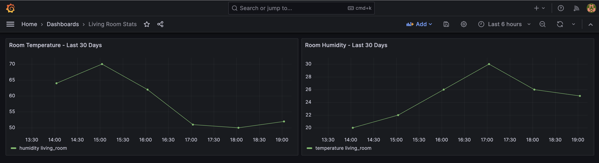

# Grafana & InfluxDB Setup with Docker

This repository provides a simplified setup for Grafana and InfluxDB using Docker. It demonstrates how to provision data sources and dashboards automatically.


## Project Structure

```
your_project_root/
│
├── docker-compose.yml
│
└── provisioning/
├── datasources/
│   └── datasources.yaml
│
└── dashboards/
├── dashboards.yaml
└── my_dashboard.json
```

## Steps to Set Up

1. **Start the Services**: Navigate to your project root and run the following command to start Grafana and InfluxDB:

```bash
docker-compose up -d
```

2. **Run the Data Generation Script**: Ensure you have the required Python libraries installed:

```bash
pip3 install influxdb-client
```

Run the Python script to generate and insert sample room temperature data:

```bash
python3 generate_data.py
```

3. **Access Grafana**: Navigate to `http://localhost:3000/`. The default login is `admin` for both username and password. Grafana should have an InfluxDB data source configured and a dashboard ready with your data.

4. **Modify & Extend**: You can modify the data generation script as needed. Add new dashboards by exporting their JSON model from Grafana and placing them in the `provisioning/dashboards/` directory.

## Troubleshooting

- **Datasource Configuration**: Ensure that the data source is set to connect using the Flux language, which is the query language for recent versions of InfluxDB.

- **Data Generation**: If you encounter authentication issues while generating data, ensure the token, organization, and bucket are correctly set in both the Python script and the `datasources.yaml`.

- **Provisioning**: If changes to your provisioning configurations don't seem to take effect, try restarting the Grafana container:

```bash
docker-compose restart grafana
```

## Conclusion

This setup provides a seamless integration between Grafana and InfluxDB, showcasing the power of visualizations and the simplicity of Docker-based deployments.